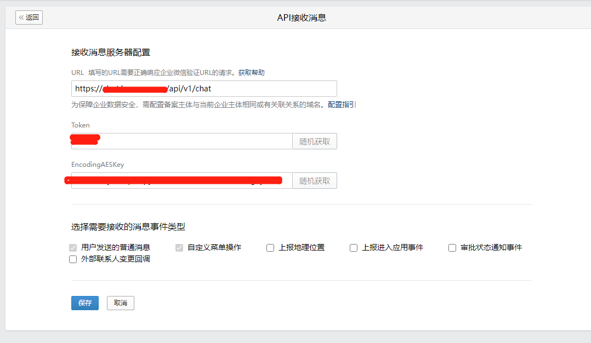

# chatGPT

## 提供功能

- 企业微信自建应用与chatGPT对接实现聊天功能
- 提供websocket服务,结合js/vue等前端框架实现类似chatGPT官网页面对话功能
- 缓存企业微信用户关联的上下文,使用redis定长队列缓存最近6次对话历史,缓存时间一小时

## 项目说明

- 安装redis
- 准备chatGPT open_api_key，如果有能力可以注册多个账号,每次向chatGPT发送请求时可以随机获取一个key
- 缓存定长的上下文为了避免过度消耗token，现在新账号注册成功好像都是5刀的额度，尽量节省token又不失上下文的缺失
- 准备代理服务，访问chatGPT需要提供代理设置，如果部署在海外云服务器，则可忽略代理以及配置文件中proxy配置
- 企业微信应用API接收功能设置与验证，这一步比较繁琐,稍后举一个例子说明
- 项目根目录sit_config.toml作为配置文件，里面包含redis、proxy、企业微信、chatgpt等设置,按实际配置填写即可

## 激活企业微信应用API接收功能



其中token、encodingAESKey随机获取即可,URL需要填写域名，且该域名是企业备案主体或有关联的域名，另外还需要能从公网访问到该域名，
这里假如部署此项目的服务器在企业内网的IP是192.168.10.10，那么服务启动后提供的验证接口API是http://192.168.10.10:52712/api/v1/chat，
接下来将192.168.10.10:52712映射到公网X.X.X.X:52712，否则企业微信无法访问到该接口(同样如果服务部署在海外云服务器，公网映射这一步也忽略)，
最后将备案后的域名关联解析到映射后的公网X.X.X.X:52712，最终将域名https://xxx.xxx.xxx/api/v1/chat粘贴至URL,暂时不要点击保存按钮,准备服务部署

## 服务部署

```bash
git clone git@github.com:xxddpac/chatgpt.git
cd chatgpt
docker build -t chatgpt .
docker run -d -p 52712:52712 -v /var/log:/var/log --name 'secchatgpt' chatgpt
```

## 请求验证

点击保存按钮，验证通过，进入应用聊天框开始chatGPT对话。
如验证不通过，请检查域名连通性及服务日志
```bash
docker logs secchatgpt
```

## websocket

项目根目录下websockets_client.py为测试客户端，使用js/vue作为websocket客户端连接ws://X.X.X.X:52712/ws即可